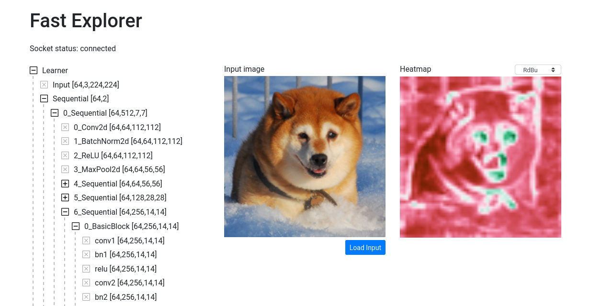

# Fast Explorer
> Work in progress


A utility to visualize models.

Main idea:
* Use this library to attach a learner and initialize a proxy server.
* Connect a javascript client via [fastexplorer-js](https://github.com/renato145/fastexplorer-js).
* Send back and forth relevant information to be visualized.

This will allow to use tools like d3, react and threejs to visualize NN information.

## Install

`pip install git+https://github.com/renato145/fastexplorer.git`

## How to use

```
# all_slow
%reload_ext autoreload
%autoreload 2
```

Load you Learner as usual and import fastexplorer:

```
from fastai.vision.all import *
from fastexplorer.all import *

path = untar_data(URLs.PETS)
files = get_image_files(path/"images")
def label_func(f): return f[0].isupper()
dls = ImageDataLoaders.from_name_func(path, files, label_func, item_tfms=Resize(224))
learn = cnn_learner(dls, resnet34, metrics=accuracy)
```

When ready, start serving the server:

```
#srv
learn.fastexplorer(True)
```

    INFO:root:To visualize the model information, go to:
    INFO:root:https://renato145.github.io/fastexplorer-js
    INFO:     Started server process [4507]
    INFO:uvicorn.error:Started server process [4507]
    INFO:     Waiting for application startup.
    INFO:uvicorn.error:Waiting for application startup.
    INFO:     Application startup complete.
    INFO:uvicorn.error:Application startup complete.
    INFO:     Uvicorn running on http://0.0.0.0:8000 (Press CTRL+C to quit)
    INFO:uvicorn.error:Uvicorn running on http://0.0.0.0:8000 (Press CTRL+C to quit)
    INFO:     Shutting down
    INFO:uvicorn.error:Shutting down
    INFO:     Waiting for application shutdown.
    INFO:uvicorn.error:Waiting for application shutdown.
    INFO:     Application shutdown complete.
    INFO:uvicorn.error:Application shutdown complete.
    INFO:     Finished server process [4507]
    INFO:uvicorn.error:Finished server process [4507]


Finally, go to [https://renato145.github.io/fastexplorer-js/](https://renato145.github.io/fastexplorer-js/) to visualize the model:


Also, you can visualize the [Loss Landscape](https://arxiv.org/abs/1712.09913):
> Note that the original work calculates the landscape using the whole dataset which can take a lot of time. In this library, I am using just one batch of data to calculate the landscape (this will probably change once I find a faster way to calculate it).


